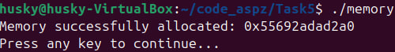
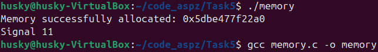
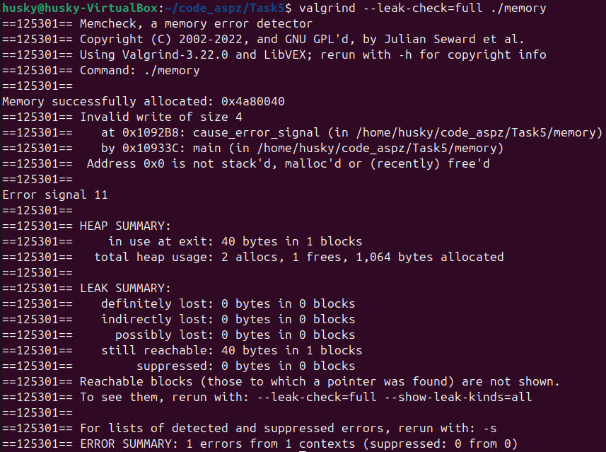

# PR5

## Завдання 1 (12 варіант)
### Моїм завданням було створити диамічно би виділяв пам'ять, проте робив би витіки, у випадку його вимкненні, викиду або вияві сигналу (Наприклад, сигналу SIGSEGV - сигналу, який виникає при присвоєнні пойнтеру на NULL значень, присвоєння значень елементам поза масиву, доступ до комірки пам'яті після free() і т.д.).
### Це завдання я, перевіривши та створивши штучні умови для виникнення витіку пам'яті я створив наступним чином:
```
#include <stdio.h>
#include <signal.h>
#include <stdlib.h>

void wait_for_input(){ // just program to wait and ignore any input
    printf("Press Enter to continue...");
    int c = getchar();

    while(c != EOF && c != '\n'){
        c = getchar();
    }
}

void signal_handler(int sig){ // what func is called when error signal appears
    fprintf(stderr, "Signal %d\n", sig);
    // NO MEMORY FREE
    exit(1);
}

void cause_error_signal(){ // func special for causing memory segmentation error
    int *p = NULL;
    *p = 1011;
}

int main(int argc, char const *argv[])
{
    signal(SIGSEGV, signal_handler); // to catch signal 
    // SIGSEGV - is signal that appears when:
    //      accessing memory after free()
    //      accessing out-of-bounds array element
    //      stack overflow
    //      dereferencing a NULL pointer
    //      etc...

    int *buff = calloc(10, sizeof(int));
    if(!buff){ // if buff == NULL
        perror("calloc error");
        return 1;
    }

    printf("Memory successfully allocated: %p\n", (void*)buff);
    
    // Doing some stuff with memory

    // cause_error_signal(); // cause error 
    wait_for_input();

    free(buff);
    printf("Memory is free!\n");
    return 0;
}
```

### Зробив кілька перевірок на коректність роботи:
 
### Викличемо функцію cause_error_signal();

### Та перевіримо за допомогою valgrind:
 
### Як ми бачимо, конекретно тут пам'ять не втрачено повністю, оскільки сам вказівник не згубив адресу виділеної пам'яті, проте все ж пам'ять зайнято